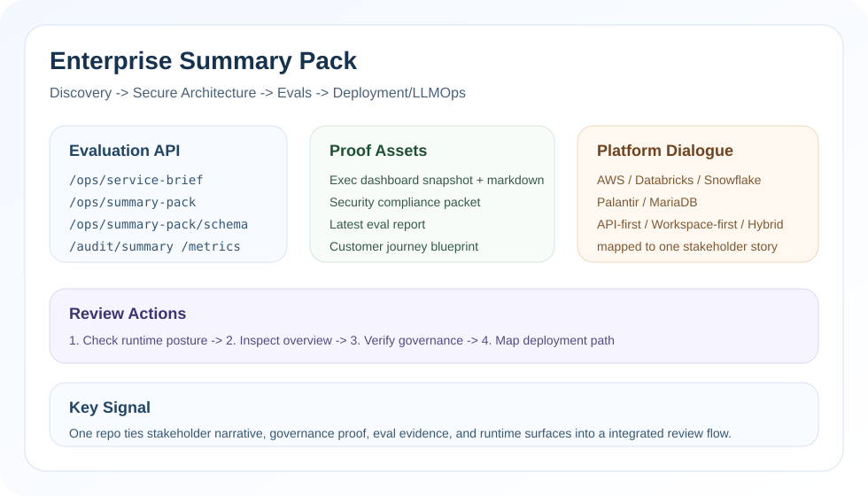

# Enterprise LLM Adoption Kit (Korea) - 포트폴리오
Tagline: Discovery -> Secure Architecture -> Evals -> Deployment/LLMOps
Note: 리뷰 가능한 엔터프라이즈 검증 키트용 포트폴리오 프로젝트입니다. 실제 고객/프로덕션 배포는 없으며 모든 데이터와 시나리오는 합성 또는 가정된 내용입니다.

영문 버전: `README.md`

## 데모 영상
- YouTube: https://youtu.be/yMq03b0js0E

## 스냅샷


## Summary Pack 한눈에 보기
- 리뷰어 API: `GET /ops/service-brief`, `GET /ops/summary-pack`, `GET /ops/summary-pack/schema`
- 증거 번들: exec dashboard snapshot, security packet, customer journey blueprint, latest eval report
- 플랫폼 대화: AWS, Databricks, Snowflake, Palantir, MariaDB 롤아웃 매핑을 한 팩에 압축

## Quick Start
- **AI engineer 면접관:** `GET /ops/service-brief` -> `POST /auth/login` -> `POST /uc1/architecture` -> `POST /uc2/log-intel`
- **솔루션 아키텍트 면접관:** [`docs/architecture/llm_deployment_options.md`](docs/architecture/llm_deployment_options.md) -> `GET /ops/summary-pack`
- **운영 / 플랫폼 리뷰어:** `GET /audit/summary` -> `GET /ops/runtime/scorecard` -> `GET /metrics`



## 프로젝트 요약 (신입/핸즈온 관점)
- 엔터프라이즈 LLM 도입의 Discovery 결과가 어떻게 안전하고 검증 가능한 PoC로 이어지는지 end-to-end로 보여주기 위해 만들었습니다.
- 백엔드 + 프론트엔드 데모를 직접 구성해 로컬에서 재현 가능한 형태로 제공합니다.
- 범위를 현실적으로 제한했습니다: LLM은 stub adapter, 데이터는 synthetic, 한계는 명시적으로 적어 포트폴리오 신뢰도를 지켰습니다.

## 역할 및 범위
- 백엔드 API, 프론트엔드 UI, eval harness, 기술 검토 산출물을 단독 구현했습니다.
- 주장보다 재현을 우선했습니다: 모든 항목은 문서, 테스트, 또는 스크립트로 검증 가능합니다.
- 신입 온보딩 관점으로 설계했습니다: 역할 분리, 간단한 실행 절차, 안전한 기본값을 유지했습니다.
- GitHub Actions로 CI 체크(backend quality gate, frontend build, eval gate)를 추가했습니다.

## 핵심 기능 (실제로 동작 확인 가능한 항목)
- RBAC 기반 접근 제어 (retrieval 단계에서 적용)
- Prompt injection 탐지 + safety refusal
- PII redaction 및 감사 로그(enterprise 모드 해시)
- RAG-style retrieval (Chroma + deterministic hash embeddings)
- Evals 리포트 + baseline diff
- LLMOps 지표 (latency, token, usage, policy events)
- 통합 패턴: Slack/Jira 스타일 ingestion 엔드포인트(UI에서 시뮬레이션 가능)
- Scenario Runner가 Markdown 리포트를 export하고, 로컬 run history(브라우저 localStorage)를 유지합니다
- 기술 검토 아티팩트: discovery wizard, Impact 계산기, 데모 스크립트, exec deck

## 아키텍처 요약 (로컬 데모)
- FastAPI 백엔드: UC1/UC2 흐름, audit log, metrics, integrations
- React(Vite) 프론트엔드 데모 UI
- Chroma 로컬 RAG 저장소
- SQLite 일일 비용 집계

## 트러블슈팅 & 검증 노트 (재현 가능한 체크)
- RBAC 누수 리스크: retrieval 단계에서 access-group 필터 적용 + 결과 메타데이터 재검증. 확인: `tests/test_rbac.py`와 `docs/blueprint/06_acceptance_tests.md`의 AT-02.
- Safety guardrails: refusal 규칙 + injection 탐지. 확인: `tests/test_safety_guardrails.py`, `tests/test_injection.py`.
- 감사 로그 데이터 처리: enterprise 모드에서 입력/출력 해시 저장. 확인: `tests/test_data_handling_mode.py`.
- RAG cold-start: 인덱스 자동 빌드 + normalized 데이터 생성. 확인: 데모 실행 후 UC1 응답에 citations 표시 여부 확인.
- Python 3.14 호환성: `chromadb` import가 깨지는 경우(pydantic-v1 이슈)에도 deterministic local retrieval 백엔드로 자동 폴백되어 데모 흐름이 계속 동작합니다.
- LLM 신뢰성: provider 오류 시 exponential backoff 재시도 + `/metrics` 지표 기록.

## 이 프로젝트가 보여주는 것
- 엔터프라이즈 discovery 결과를 아키텍처 결정으로 변환
- LLM 통합 패턴(RBAC, audit logging, redaction, injection defense, tool allowlist)
- 회귀 방지 evals + baseline diff
- LLMOps 준비 상태(metrics, reliability controls, usage tracking)
- 기술 검토 아티팩트(데모 스크립트, objections, MAP, 30/60/90)
- LLM 도입 경로(API vs LLM Workspace) 및 하이브리드 롤아웃 계획

## 증빙 (확인 포인트)
- RBAC 검증: [docs/blueprint/06_acceptance_tests.md](docs/blueprint/06_acceptance_tests.md)의 AT-02 (Employee vs Admin 동일 쿼리 비교)
- Audit 로그: [app/backend/data/sample_audit.json](app/backend/data/sample_audit.json)
- Eval 리포트: [evals/reports/latest_report.md](evals/reports/latest_report.md)
- Metrics: [docs/blueprint/05_llmops_plan.md](docs/blueprint/05_llmops_plan.md) 및 `GET /metrics`
- 데모 스크립트: [docs/review_assets/demo_script_exec.md](docs/review_assets/demo_script_exec.md), [docs/review_assets/demo_script_eng.md](docs/review_assets/demo_script_eng.md)

빠른 검증:
```bash
make quality-check
ls app/backend/data/sample_audit.json evals/reports/latest_report.md docs/review_assets/demo_script_exec.md docs/review_assets/demo_script_eng.md docs/blueprint/06_acceptance_tests.md
curl -fsS http://localhost:8000/metrics | head -n 20
curl -fsS http://localhost:8000/ops/service-brief | python3 -m json.tool | head -n 60
curl -fsS http://localhost:8000/ops/summary-pack | python3 -m json.tool | head -n 60
curl -fsS http://localhost:8000/ops/summary-pack/schema | python3 -m json.tool | head -n 40
curl -fsS http://localhost:8000/ops/service-brief/schema | python3 -m json.tool | head -n 40
```

## Runtime Surface
- `GET /ops/service-brief`: 이해관계자/운영자/리뷰어가 바로 읽을 수 있는 runtime + evidence + rollout stage 요약 계약
- `GET /ops/summary-pack`: executive review surface, rollout tracks, platform dialogue, review sequence를 한 번에 보여주는 계약
- `GET /ops/summary-pack/schema`: review actions, test assets, runtime surfaces에 대한 명시적 계약 표면
- `GET /ops/service-brief/schema`: service brief payload의 명시적 계약 표면
- Home/Readiness UI에 `Executive Readiness Board`와 `Executive Summary Pack`을 추가해 review actions, test assets, runtime surfaces까지 정적 fallback으로 유지합니다

## 고객 여정 (Discovery -> Production)
- Blueprint: `docs/blueprint/09_customer_journey.md`
- Deployment options (API vs Workspace): `docs/architecture/llm_deployment_options.md`
- Eval framework template: `docs/evals/eval_framework_template.md`
- Eval report template: `docs/evals/customer_eval_report_template.md`
- Executive summary template: `docs/review_assets/executive_summary_template.md`
- Technical deep dive outline: `docs/review_assets/technical_deep_dive_outline.md`
- Capability alignment: `docs/technical_review/capability_alignment.md`
- Security & compliance packet: `docs/review_assets/security_compliance_packet.md`
- LLM Workspace checklist: `docs/review_assets/llm_workspace_checklist.md`
- RFP requirements matrix: `docs/technical_review/rfp_requirements_matrix.md`
- QBR template: `docs/review_assets/qbr_template.md`
- Sample scenario (one-pager): `docs/review_assets/sample_scenario_onepager.md`

## 로컬 실행
1) Backend
```
cd app/backend
python3 -m venv .venv
source .venv/bin/activate
pip install -r requirements.txt
python3 -m app
```
선택: 로컬 Ollama 런타임 사용
```bash
# 터미널 A
ollama serve

# 터미널 B (백엔드 실행 전)
export LLM_PROVIDER=ollama
export LLM_MODEL=llama3.1:8b
export LLM_OLLAMA_BASE_URL=http://127.0.0.1:11434
python3 -m app
```
2) Frontend
```
cd app/frontend
npm install
npm run dev
```
3) 접속: `http://localhost:5173`

## Docker 실행
```
cd infra
docker-compose up --build
```

## 원커맨드 데모 (Docker 없이)
Docker가 없다면 로컬 러너 스크립트를 사용하세요:
```bash
# auto 모드: Ollama가 있으면 우선 사용, 없으면 stub으로 자동 폴백
make demo-local
```

## Ollama 빠른 시작 (권장)
외부 API 키 없이 로컬 모델로 전체 흐름을 바로 체험할 수 있습니다.

```bash
# Ollama 설치: https://ollama.com/download
ollama pull llama3.2:latest
make demo-ollama-local
```

스크립트가 backend + frontend를 함께 실행하고 `http://localhost:5173`에서 리뷰 가능한 데모를 제공합니다.

## 효용 체감 5분 투어
기능 확인을 넘어 "왜 유용한지"가 보이는 순서입니다.

1. Access Control에서 `Ops` 토큰 발급
2. UC1에 핸드오버 질의 입력 (예: "payment-prod handover risks and next actions")
3. UC2에 timeout/error 로그 입력 후 root cause + runbook step 확인
4. Scenario Runner에서 report + evidence pack(zip + SHA-256 manifest) 내보내기
5. `/audit/summary`, `/metrics`를 함께 확인해 거버넌스/운영 신호 검증

## Scenario Runner (CLI)
실행 결과를 공유 가능한 리포트(Markdown) + 증빙 패키지(zip)로 내보냅니다.

백엔드가 이미 실행 중일 때:
```bash
make scenario-run
```

원커맨드(auto: Ollama 가능 시 우선 사용, 아니면 stub):
```bash
make scenario-demo-local
```

Ollama 강제 모드:
```bash
make scenario-demo-ollama-local
```

출력은 `dist/scenario_runs/` 아래에 저장됩니다(gitignore).

## 원커맨드 데모 (Docker)
```
make demo
```

## Evaluation
- Datasets: `evals/datasets/initial_20.jsonl`, `evals/datasets/starter_50.jsonl`
- Runner: `python3 evals/runner/run_eval.py --dataset evals/datasets/initial_20.jsonl`
- Reports: `evals/reports/latest_report.json`, `evals/reports/latest_report.md`, baseline diff

## 테스트
```bash
pytest -q
```

## 백엔드 품질 게이트
```bash
make quality-backend
```

## Metrics
- Prometheus endpoint: `GET /metrics`
- Request counters, latency histogram, token usage, usage estimates, policy events

## 프로덕션 런타임 옵션 (구현됨)
- 인증 모드:
  - `AUTH_MODE=local_jwt` (기본) 또는 `AUTH_MODE=oidc`
  - OIDC 검증: `OIDC_ISSUER`, 선택 `OIDC_AUDIENCE`, 선택 `OIDC_JWKS_URL`
  - 선택 로그인 하드닝: `DEMO_LOGIN_CODE=<shared-code>` (`POST /auth/login` 시 코드 요구)
  - 로그인 남용 방어(로그인 코드 사용 시): `LOGIN_ATTEMPT_CAPACITY=10`, `LOGIN_ATTEMPT_REFILL_PER_SEC=0.1`
- JWT 키 회전:
  - `JWT_ACTIVE_KID=v2`
  - `JWT_SECRETS="v1:old-secret,v2:new-secret"` (또는 `JWT_SECRETS_FILE` JSON)
- OIDC 토큰 교환:
  - `POST /auth/oidc/exchange` with `{ "id_token": "..." }`
- LLM provider:
  - `LLM_PROVIDER=stub` (기본, 오프라인), `LLM_PROVIDER=ollama`, 또는 `LLM_PROVIDER=openai` / `LLM_PROVIDER=openai_compatible`
  - `LLM_OLLAMA_BASE_URL` (기본값 `http://127.0.0.1:11434`)
  - Ollama 로컬 모드(키 불필요): `LLM_PROVIDER=ollama`, 선택 `LLM_MODEL=llama3.2:latest`, 선택 `LLM_OLLAMA_BASE_URL=http://127.0.0.1:11434`
  - `LLM_OPENAI_API_KEY` (또는 `LLM_OPENAI_API_KEY_FILE`)
  - 선택 `LLM_OPENAI_BASE_URL`, `LLM_OPENAI_ORG`
  - 안정성 fallback: `LLM_FALLBACK_TO_STUB_ON_ERROR=true` (기본)
  - 서킷 브레이커: `LLM_CIRCUIT_BREAKER_THRESHOLD=3`, `LLM_CIRCUIT_BREAKER_COOLDOWN_SEC=30`
- Integration 인증:
  - `INTEGRATIONS_REQUIRE_AUTH=true` (기본)
  - 활성화 시 `POST /integrations/slack/events`, `POST /integrations/jira/ticket`는 `Authorization: Bearer <JWT>` 필요
  - Bearer 토큰에 복수 role이 있으면 통합 실행 role은 최고 권한(`Admin > Ops > Employee`)으로 선택
- 요청 가드레일:
  - `REQUEST_MAX_BODY_BYTES=262144` (기본)
  - 이 값을 초과하는 payload는 `413 Request body too large` 반환
  - 검증 실패는 `request_id`/정규화 에러 목록을 포함한 표준 `422` 응답 형태로 반환
- 운영 정책/알림:
  - `GET /ops/policy`
  - `GET /ops/alerts` 및 `GET /ops/alerts?deliver=true`
  - 선택 웹훅: `OPS_ALERT_WEBHOOK_URL`
- 이벤트 로그 위생:
  - service event/control-tower context 저장 전 token/secret/password 계열 필드를 자동 마스킹
- 저장소 백엔드:
  - `EVENT_STORAGE_BACKEND=sqlite` (기본) 또는 `EVENT_STORAGE_BACKEND=jsonl`
  - JSONL 경로: `SERVICE_EVENTS_JSONL_PATH`, `CONTROL_TOWER_DECISIONS_JSONL_PATH`, `DAILY_COST_JSON_PATH`

## Capability alignment
- Employee: limited docs
- Ops: ops docs
- Admin: all docs

## Swap-in 가이드
- **OIDC/SAML**: `/auth/login`을 외부 IdP로 대체, IdP 공개키로 JWT 검증
- **LLM API**: `LLMAdapter`에 provider SDK 연결, token usage + usage 매핑
- **LLM Workspace**: SSO/SAML 및 enterprise governance 기준에 맞춘 정책 정렬
- **Cloud storage**: local SQLite/file path를 managed DB/object store로 교체

## Review Kit Extras
- Discovery Wizard: `python3 app/backend/scripts/discovery_wizard.py`
- Impact Calculator: `python3 app/backend/scripts/impact_calculator.py --handle-time-min 12 --tickets-per-week 800 --deflection-rate 0.25 --adoption-rate 0.6`
- PoC Success Generator: `python3 app/backend/scripts/poc_success_generator.py`
- BYO Dataset Ingest: `python3 evals/runner/dataset_ingest.py --input evals/datasets/sample_dataset.csv`
- Eval Gate: `make eval-gate`
- Audit Viewer: `python3 app/backend/scripts/audit_viewer.py --log app/backend/data/audit.log` (런타임 생성)
- Exec Deck: `python3 app/backend/scripts/generate_exec_deck.py`
- Modules index: `docs/modules/README.md`
- Integration demo checklist: `docs/review_assets/integration_demo_checklist.md`
- Red-team summary: `docs/evals/redteam_summary.md`
- Exec dashboard snapshot: `docs/review_assets/exec_value_dashboard/snapshot.svg`
이 증빙/데모 스크립트는 discovery 및 PoC 정렬 대화에서 재현 가능한 근거로 사용하도록 설계되었습니다.

## UI 둘러보기 (로컬)
- 탭: Overview / Capabilities / Readiness / Scenario Runner / Console
- Scenario Runner: JWT -> UC1 -> UC2 -> governance/ops 체크를 한 번에 실행하고 Markdown 리포트를 내보냅니다.
- Console: UC1/UC2를 직접 호출하고 `/audit/summary`, `/ops/runtime`를 로드해 검증합니다(권한 필요).

## 공개 전 정리 (푸시 전에)
이 레포는 공개 가능한 형태로 설계했습니다: 런타임 데이터(SQLite DB, audit log, Chroma persistence)는 로컬에서 생성되며 git에서 무시됩니다.

```bash
make sanitize
```

## KR evals
- KR dataset: `evals/datasets/kr_enterprise_30.jsonl`
- KR eval run: `python3 evals/runner/run_eval.py --dataset evals/datasets/kr_enterprise_30.jsonl`
