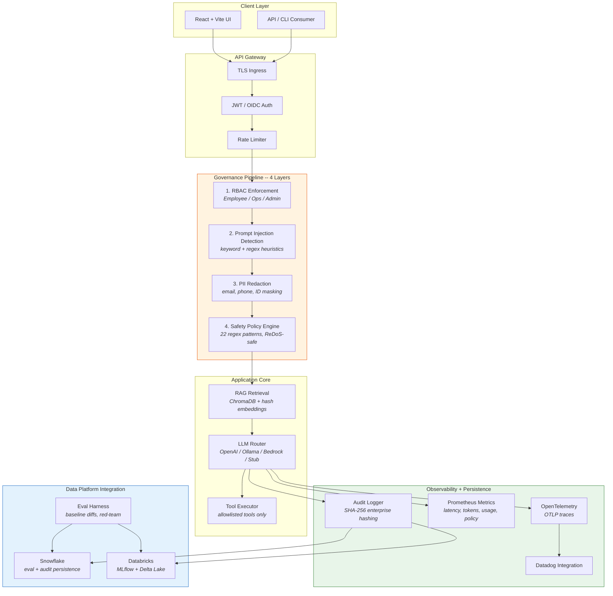

# Enterprise LLM Adoption Kit

[](https://github.com/KIM3310/enterprise-llm-adoption-kit/actions/workflows/ci.yml)
[](https://github.com/KIM3310/enterprise-llm-adoption-kit/actions/workflows/security-scan.yml)
[](https://github.com/KIM3310/enterprise-llm-adoption-kit/actions/workflows/docker-publish.yml)
[](https://www.python.org/downloads/)
[](LICENSE)

**Production-grade governance toolkit for enterprise LLM deployments** -- RBAC, prompt-injection detection, PII redaction, audit logging, eval harness, and multi-cloud LLM routing, all wired into a single FastAPI + React application with Kubernetes-ready infrastructure.

> All rollout data and review scenarios are synthetic. The goal is a reviewable, runnable validation kit that demonstrates enterprise-grade LLM governance patterns end to end.

Technical review pack: [`docs/architecture-pack.md`](docs/architecture-pack.md)

Demo video: [https://youtu.be/yMq03b0js0E](https://youtu.be/yMq03b0js0E)

---

## Three-Minute Proof

1. Open [`docs/architecture_assets/poc_success_criteria.md`](docs/architecture_assets/poc_success_criteria.md) to see the production test boundary.
2. Inspect the governance path: RBAC, prompt-injection checks, PII redaction, audit logging, and eval gates.
3. Run `make verify` to cover backend quality, smoke checks, and frontend build.
4. Keep synthetic data and environment-gated live providers explicit in any technical review.

## System Overview

| Lens | Current answer |
|---|---|
| Users | Enterprise AI adoption, IT governance, security, platform, and operations teams that need controlled LLM rollout. |
| Technical path | Validate the demo, README, architecture notes, and quality gate before deeper workflow review. |
| System scope | RBAC, prompt-injection checks, PII redaction, audit logs, eval gates, Snowflake/Databricks adapters, and deployment scaffolding in one runnable kit. |
| Operating boundary | Synthetic rollout scenarios by default; external providers and enterprise data adapters are environment-gated. |
| Evaluation path | `make verify`, [`docs/architecture-pack.md`](docs/architecture-pack.md), and [`docs/architecture_assets/poc_success_criteria.md`](docs/architecture_assets/poc_success_criteria.md). |

## Evaluation Path

- **Start here:** Open the governance layers, eval gate, and PoC success criteria before the full architecture.
- **Local demo:** Run the backend and frontend quick-start commands, then open `http://localhost:8000` and `http://localhost:5173`.
- **Checks:** Run `make verify`; it covers backend quality, smoke checks, and frontend build.

---

## Service Launch Playbook

- [Service launch playbook](docs/service-launch-playbook.md) maps the repository to its product scope, operating gates, operating boundaries, and risk controls.

## Architecture Notes

- [Review guide](docs/architecture-evidence-map.md) summarizes the system scope, first files to inspect, verification commands, and known boundaries.
- [Quality notes](docs/quality-gate.md) lists the local checks, CI surface, and release expectations for this repository.
- [Enterprise readiness notes](docs/enterprise-readiness.md) outlines security, data, operations, integration, and handoff expectations.

## Architecture

Every request passes through four governance layers before reaching the LLM. Each layer can short-circuit the request with a policy refusal, and every decision is audit-logged.



---

## Tech Stack

| Layer | Technologies |
|---|---|
| **Backend API** | Python 3.11+, FastAPI, Uvicorn, Pydantic |
| **Frontend** | React 18, Vite |
| **Auth** | JWT (HS256) with key rotation, OIDC (RS256) via JWKS discovery |
| **RAG** | ChromaDB, deterministic hash embeddings, in-memory fallback |
| **LLM Providers** | OpenAI, Ollama, AWS Bedrock, stub (offline deterministic) |
| **Eval** | Custom harness -- accuracy, groundedness, helpfulness, safety scoring |
| **Storage** | SQLite, Chroma, JSONL event logs |
| **Data Platform** | Snowflake (eval + audit), Databricks (MLflow + Delta Lake) |
| **Observability** | Prometheus, Grafana, OpenTelemetry (OTLP), Datadog-ready |
| **Infrastructure** | Docker Compose, Kubernetes (HPA, TLS ingress, AlertManager), Terraform (AWS + GCP) |
| **CI/CD** | GitHub Actions (CI, security scan, Docker publish, Cloudflare Pages deploy) |
| **Security** | pip-audit, Bandit, Trivy container scanning |

---

## Quick Start

### One-command demo (recommended)

```bash
git clone https://github.com/KIM3310/enterprise-llm-adoption-kit.git
cd enterprise-llm-adoption-kit
make demo-local        # auto-selects Ollama if available, otherwise stub
```

### Manual setup

```bash
# 0. Backend requires Python 3.11+.
# If your default python3 is older, pass a known interpreter:
# make BOOTSTRAP_PYTHON=/path/to/python3.11 backend-install

# 1. Backend
make backend-install
cd app/backend && .venv/bin/python -m app
# starts on http://localhost:8000

# 2. Frontend (separate terminal)
cd app/frontend
npm install && npm run dev        # starts on http://localhost:5173

# 3. Verify everything
make verify                       # syntax, deps, pytest, smoke, frontend build
```

### Docker

```bash
cd infra && docker-compose up --build
# Backend: http://localhost:8000   Frontend: http://localhost:5173
```

### Kubernetes

```bash
kubectl create namespace llm-adoption
kubectl apply -f infra/k8s/secret.yaml
kubectl apply -f infra/k8s/
```

---

## Key Capabilities

| Capability | Description | Code |
|---|---|---|
| **RBAC** | Role-to-access-group mapping enforced at RAG retrieval time (Employee / Ops / Admin) | [`app/backend/app/rbac.py`](app/backend/app/rbac.py) |
| **Prompt Injection Detection** | Keyword heuristics flag known injection patterns before LLM invocation | [`app/backend/app/injection.py`](app/backend/app/injection.py) |
| **Safety Policy Engine** | 22 regex patterns targeting exfiltration, escalation, and adversarial prompts (ReDoS-safe) | [`app/backend/app/safety.py`](app/backend/app/safety.py) |
| **PII Redaction** | Email, phone, and ID masking with per-category event tracking | [`app/backend/app/redaction.py`](app/backend/app/redaction.py) |
| **Audit Logging** | Structured JSON logs with SHA-256 hashing in enterprise mode and auto-retention pruning | [`app/backend/app/audit.py`](app/backend/app/audit.py) |
| **RAG Retrieval** | ChromaDB + deterministic hash embeddings with RBAC-filtered document access | [`app/backend/app/rag.py`](app/backend/app/rag.py) |
| **Eval Harness** | Accuracy, groundedness, helpfulness, safety scoring with baseline diffs and red-team datasets | [`evals/runner/`](evals/runner/) |
| **LLMOps Metrics** | Request latency, token counts, usage tracking, policy events via Prometheus | [`app/backend/app/metrics.py`](app/backend/app/metrics.py) |
| **Circuit Breaker** | LLM provider failure isolation with configurable threshold and cooldown | [`app/backend/app/llm_adapter.py`](app/backend/app/llm_adapter.py) |
| **Multi-provider LLM** | Hot-swappable runtime config across OpenAI, Ollama, Bedrock, and stub backends | [`app/backend/app/llm_adapter.py`](app/backend/app/llm_adapter.py) |
| **Snowflake Integration** | Eval results and audit logs persisted to Snowflake (env-var gated) | [`app/backend/app/snowflake_adapter.py`](app/backend/app/snowflake_adapter.py) |
| **Databricks Integration** | MLflow experiment tracking and Delta audit tables in Unity Catalog | [`app/backend/app/databricks_adapter.py`](app/backend/app/databricks_adapter.py) |
| **OpenTelemetry** | OTLP trace export with Datadog-ready integration | [`app/backend/app/telemetry.py`](app/backend/app/telemetry.py) |

---

## Core API

| Endpoint | Description |
|---|---|
| `POST /auth/login` | Issue JWT (local_jwt or OIDC mode) |
| `POST /uc1/architecture` | LLM-assisted architecture query (RBAC-gated RAG) |
| `POST /uc2/log-intel` | Log intelligence and root cause generation |
| `GET /audit/summary` | Governance and audit log summary |
| `GET /metrics` | Prometheus metrics (requests, latency, tokens, usage, policy events) |
| `GET /health` | Runtime posture and diagnostics |
| `GET /ops/service-brief` | Operational service brief and readiness summary |
| `GET /ops/resource-pack` | Resource pack for review and evidence |

---

## Snowflake / Databricks Integration

**Snowflake** -- set `SNOWFLAKE_ACCOUNT` to activate. Stores eval results and audit logs; supports `query_eval_history()`, `query_audit_history()`, aggregate reporting.

**Databricks** -- set `DATABRICKS_HOST` to activate. MLflow experiment tracking per eval run; Delta audit tables in Unity Catalog; `databricks-cli` or service-principal OAuth auth.

See [`.env.example`](.env.example) for the full configuration surface.

---

## Datadog-Ready Pack

- Datadog-ready resource pack: [`docs/datadog/README.md`](docs/datadog/README.md)
- Existing env hooks already reserve a Datadog integration lane in `.env.example`
- Current state: asset sync and OTLP wiring are prepared, but live tenant integration is intentionally disabled by default
- Best use: show how enterprise LLM governance, audit, latency, and rollout readiness would be observed in one operator-facing Datadog surface

---

## Project Structure

```
enterprise-llm-adoption-kit/
  app/
    backend/               # FastAPI backend (RBAC, RAG, safety, audit, LLM adapters)
      app/
        main.py            # FastAPI app with governance middleware
        rbac.py            # Role-to-access-group mapping
        safety.py          # 22-pattern safety policy engine
        injection.py       # Prompt injection detection
        redaction.py       # PII redaction engine
        audit.py           # Structured audit logging with SHA-256 hashing
        auth.py            # JWT/OIDC authentication
        llm_adapter.py     # Multi-provider LLM router with circuit breaker
        rag.py             # ChromaDB RAG with RBAC-filtered retrieval
        snowflake_adapter.py
        databricks_adapter.py
        metrics.py         # Prometheus metric definitions
        telemetry.py       # OpenTelemetry instrumentation
        config.py          # 60+ env vars, type-safe parsing
    frontend/              # React + Vite UI
  evals/
    runner/                # Eval harness (run_eval, eval_gate, baseline)
    datasets/              # Test datasets (initial, red-team, Korean)
    reports/               # Generated eval reports and diffs
  infra/
    k8s/                   # Kubernetes manifests (HPA, TLS, AlertManager)
    aws/terraform/         # AWS ECS + ALB Terraform module
    gcp/terraform/         # GCP Terraform module
    docker-compose.yml     # Local multi-service orchestration
    monitoring/            # Grafana dashboard + AlertManager rules
  tests/                   # 30+ test files, 84% backend coverage
  docs/                    # Architecture, ops, blueprint, Datadog, evals docs
  scripts/                 # Demo runners, quality gates, release ops
```

---

## Technical Proof Boundary

- **Primary architecture lane:** enterprise LLM governance, applied AI controls, and platform integration
- **Strongest proof surface:** governance pipeline, eval harness, observability surfaces, and deployment-ready backend/frontend split
- **What is real here:** RBAC, safety pipeline, audit logging, metrics, integration adapters, CI/CD, and deployment scaffolding
- **What is bounded here:** review cases and documents are synthetic, and Snowflake / Databricks / Bedrock integrations are env-gated

---

## Operating Commands

- `make verify` runs the backend syntax/dependency checks, Python suite, smoke diagnostics, and frontend production build.
- `app/backend/.venv/bin/python -m pytest tests app/backend/tests -q` exercises the backend services, adapters, runtime scorecards, and UI metadata contracts.
- `cd app/frontend && pnpm build` produces the static frontend bundle used by the Cloudflare Pages deployment path.

---

## CI/CD

GHCR Docker image published on every push to `main`. Security scan (pip-audit, bandit, Trivy) runs on schedule. Frontend auto-deploys to Cloudflare Pages.

---

## Related Projects

For governed NL-to-SQL analytics, see [Nexus-Hive](https://github.com/KIM3310/Nexus-Hive). For the data pipeline layer, see [lakehouse-contract-lab](https://github.com/KIM3310/lakehouse-contract-lab).

## License

MIT

## Cloud + AI Architecture

- [Cloud + AI architecture blueprint](docs/cloud-ai-architecture.md)
- [Machine-readable architecture manifest](docs/architecture/blueprint.json)
- Validation command: `python3 scripts/validate_architecture_blueprint.py`

## Enterprise Productization

- [Product operating model](docs/product-operating-model.md) defines the product scope, trust boundary, operating checks, and service path for this repository.

## System Architecture

- [System architecture](docs/system-architecture.md) maps the runtime boundary, data/control flow, cloud or local deployment surface, and operating assumptions for this repository.

## Service Architecture

- [Service architecture](docs/service-architecture.md) defines the cloud resources, account information, usage controls, and production guardrails needed to turn this repo into a scoped service without publishing public financial assumptions.

<!-- search-growth-readme:start -->

## Search And Service Surface

- Public entry: public templates, service brief samples, and architecture docs
- Paid boundary: paid workshop pack, private control tower deployment, and governance evidence bundle
- Canonical URL: https://enterprise-llm-kit.pages.dev/
- Lead capture: https://kim3310-doeon-kim-portfolio.pages.dev/?offer=enterprise-llm-adoption-kit&inquiry=private-ai-readiness-sprint#private-inquiry
- Commercial route: https://kim3310-doeon-kim-portfolio.pages.dev/?offer=enterprise-llm-adoption-kit#service-offers
- Machine-readable offer: [docs/service-offer.json](docs/service-offer.json)
- Search growth implementation: [docs/search-growth-implementation.md](docs/search-growth-implementation.md)
- Revenue architecture: [docs/revenue-architecture.md](docs/revenue-architecture.md)

<!-- search-growth-readme:end -->
