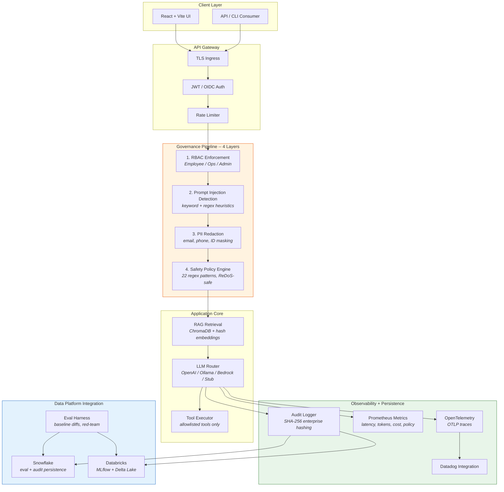

# Enterprise LLM Adoption Kit

[](https://github.com/KIM3310/enterprise-llm-adoption-kit/actions/workflows/ci.yml)
[](https://github.com/KIM3310/enterprise-llm-adoption-kit/actions/workflows/security-scan.yml)
[](https://github.com/KIM3310/enterprise-llm-adoption-kit/actions/workflows/docker-publish.yml)
[](https://www.python.org/downloads/)
[](LICENSE)

**Production-grade governance toolkit for enterprise LLM deployments** -- RBAC, prompt-injection detection, PII redaction, audit logging, eval harness, and multi-cloud LLM routing, all wired into a single FastAPI + React application with Kubernetes-ready infrastructure.

> All rollout data and review scenarios are synthetic. The goal is a reviewable, runnable validation kit that demonstrates enterprise-grade LLM governance patterns end to end.

Demo video: [https://youtu.be/yMq03b0js0E](https://youtu.be/yMq03b0js0E)

---

## Architecture

Every request passes through four governance layers before reaching the LLM. Each layer can short-circuit the request with a policy refusal, and every decision is audit-logged.



---

## Tech Stack

| Layer | Technologies |
|---|---|
| **Backend API** | Python 3.11+, FastAPI, Uvicorn, Pydantic |
| **Frontend** | React 18, Vite |
| **Auth** | JWT (HS256) with key rotation, OIDC (RS256) via JWKS discovery |
| **RAG** | ChromaDB, deterministic hash embeddings, in-memory fallback |
| **LLM Providers** | OpenAI, Ollama, AWS Bedrock, stub (offline deterministic) |
| **Eval** | Custom harness -- accuracy, groundedness, helpfulness, safety scoring |
| **Storage** | SQLite, Chroma, JSONL event logs |
| **Data Platform** | Snowflake (eval + audit), Databricks (MLflow + Delta Lake) |
| **Observability** | Prometheus, Grafana, OpenTelemetry (OTLP), Datadog-ready |
| **Infrastructure** | Docker Compose, Kubernetes (HPA, TLS ingress, AlertManager), Terraform (AWS + GCP) |
| **CI/CD** | GitHub Actions (CI, security scan, Docker publish, Cloudflare Pages deploy) |
| **Security** | pip-audit, Bandit, Trivy container scanning |

---

## Quick Start

### One-command demo (recommended)

```bash
git clone https://github.com/KIM3310/enterprise-llm-adoption-kit.git
cd enterprise-llm-adoption-kit
make demo-local        # auto-selects Ollama if available, otherwise stub
```

### Manual setup

```bash
# 1. Backend
cd app/backend
python3 -m venv .venv && source .venv/bin/activate
pip install -e ".[dev]"
python3 -m app                    # starts on http://localhost:8000

# 2. Frontend (separate terminal)
cd app/frontend
npm install && npm run dev        # starts on http://localhost:5173

# 3. Verify everything
make verify                       # syntax, deps, pytest, smoke, frontend build
```

### Docker

```bash
cd infra && docker-compose up --build
# Backend: http://localhost:8000   Frontend: http://localhost:5173
```

### Kubernetes

```bash
kubectl create namespace llm-adoption
kubectl apply -f infra/k8s/secret.yaml
kubectl apply -f infra/k8s/
```

---

## Key Capabilities

| Capability | Description | Code |
|---|---|---|
| **RBAC** | Role-to-access-group mapping enforced at RAG retrieval time (Employee / Ops / Admin) | [`app/backend/app/rbac.py`](app/backend/app/rbac.py) |
| **Prompt Injection Detection** | Keyword heuristics flag known injection patterns before LLM invocation | [`app/backend/app/injection.py`](app/backend/app/injection.py) |
| **Safety Policy Engine** | 22 regex patterns targeting exfiltration, escalation, and adversarial prompts (ReDoS-safe) | [`app/backend/app/safety.py`](app/backend/app/safety.py) |
| **PII Redaction** | Email, phone, and ID masking with per-category event tracking | [`app/backend/app/redaction.py`](app/backend/app/redaction.py) |
| **Audit Logging** | Structured JSON logs with SHA-256 hashing in enterprise mode and auto-retention pruning | [`app/backend/app/audit.py`](app/backend/app/audit.py) |
| **RAG Retrieval** | ChromaDB + deterministic hash embeddings with RBAC-filtered document access | [`app/backend/app/rag.py`](app/backend/app/rag.py) |
| **Eval Harness** | Accuracy, groundedness, helpfulness, safety scoring with baseline diffs and red-team datasets | [`evals/runner/`](evals/runner/) |
| **LLMOps Metrics** | Request latency, token counts, cost tracking, policy events via Prometheus | [`app/backend/app/metrics.py`](app/backend/app/metrics.py) |
| **Circuit Breaker** | LLM provider failure isolation with configurable threshold and cooldown | [`app/backend/app/llm_adapter.py`](app/backend/app/llm_adapter.py) |
| **Multi-provider LLM** | Hot-swappable runtime config across OpenAI, Ollama, Bedrock, and stub backends | [`app/backend/app/llm_adapter.py`](app/backend/app/llm_adapter.py) |
| **Snowflake Integration** | Eval results and audit logs persisted to Snowflake (env-var gated) | [`app/backend/app/snowflake_adapter.py`](app/backend/app/snowflake_adapter.py) |
| **Databricks Integration** | MLflow experiment tracking and Delta audit tables in Unity Catalog | [`app/backend/app/databricks_adapter.py`](app/backend/app/databricks_adapter.py) |
| **OpenTelemetry** | OTLP trace export with Datadog-ready integration | [`app/backend/app/telemetry.py`](app/backend/app/telemetry.py) |

---

## Core API

| Endpoint | Description |
|---|---|
| `POST /auth/login` | Issue JWT (local_jwt or OIDC mode) |
| `POST /uc1/architecture` | LLM-assisted architecture query (RBAC-gated RAG) |
| `POST /uc2/log-intel` | Log intelligence and root cause generation |
| `GET /audit/summary` | Governance and audit log summary |
| `GET /metrics` | Prometheus metrics (requests, latency, tokens, cost, policy events) |
| `GET /health` | Runtime posture and diagnostics |
| `GET /ops/service-brief` | Operational service brief and readiness summary |
| `GET /ops/resource-pack` | Resource pack for review and evidence |

---

<details>
<summary><strong>For AI Engineers</strong></summary>

### Why this matters for AI engineering roles

This toolkit demonstrates production-readiness patterns that go beyond a proof-of-concept chatbot:

- **Governance pipeline with separation of concerns** -- RBAC, injection detection, PII redaction, and safety policy are each an independent, testable module that can short-circuit a request. This mirrors how enterprise AI teams layer defenses rather than relying on a single guardrail.
- **Eval harness with regression detection** -- The eval runner scores responses on four axes (accuracy, groundedness, helpfulness, safety), computes baseline diffs, and integrates with Snowflake/Databricks for historical tracking. Red-team datasets (`evals/datasets/redteam_50.jsonl`) stress-test adversarial robustness.
- **LLM provider abstraction with circuit breaker** -- The `llm_adapter.py` supports hot-swappable provider configs, per-user BYOK API keys, and automatic stub fallback on failure, demonstrating resilience patterns for production LLM systems.
- **Prompt injection detection** -- Both keyword-heuristic (`injection.py`) and regex-based safety patterns (`safety.py`) with ReDoS protection show defense-in-depth against adversarial inputs.

### Key files to review

| File | What it demonstrates |
|---|---|
| `app/backend/app/safety.py` | 22 bounded-regex patterns with ReDoS protection |
| `app/backend/app/audit.py` | Enterprise-mode SHA-256 hashing and retention pruning |
| `evals/runner/run_eval.py` | Multi-axis eval scoring with baseline diffing |
| `app/backend/app/llm_adapter.py` | Multi-provider routing with circuit breaker and BYOK |

</details>

<details>
<summary><strong>For Data Engineers</strong></summary>

### Why this matters for data engineering roles

This project shows how LLM systems integrate with enterprise data platforms for observability, compliance, and auditability:

- **Snowflake adapter** -- Eval results and audit events are persisted to Snowflake with structured schemas. Supports `query_eval_history()` and `query_audit_history()` for aggregate reporting. All operations are env-var gated so the app runs unchanged without Snowflake credentials.
- **Databricks adapter** -- MLflow experiment tracking per eval run, Delta audit tables in Unity Catalog, and support for both `databricks-cli` unified auth and service-principal OAuth. Demonstrates the lakehouse pattern for ML observability data.
- **Structured audit pipeline** -- Every LLM interaction produces a JSON audit event with input/output hashes (in enterprise mode), cost estimates, latency, token counts, and policy events. This is the kind of structured telemetry data platform teams build pipelines around.
- **Data handling modes** -- `demo` mode logs raw text; `enterprise` mode SHA-256 hashes all PII before it reaches the audit log, with configurable retention-based pruning.

### Key files to review

| File | What it demonstrates |
|---|---|
| `app/backend/app/snowflake_adapter.py` | Env-gated Snowflake eval + audit persistence |
| `app/backend/app/databricks_adapter.py` | MLflow tracking + Delta Lake audit tables |
| `app/backend/app/audit.py` | Structured audit events with hash-mode and retention |
| `.env.example` | Full integration configuration surface |

</details>

<details>
<summary><strong>For Solutions Architects</strong></summary>

### Why this matters for solutions architect roles

This project is a reference implementation of governed LLM adoption for enterprise environments:

- **Defense-in-depth governance** -- Four independent governance layers (RBAC, injection detection, PII redaction, safety policy) enforce policy at the API level before any LLM call. Each layer produces structured policy events for auditability.
- **Cloud-portable infrastructure** -- Terraform modules for both AWS (ECS, ALB, S3) and GCP, Kubernetes manifests with HPA and TLS ingress, Docker Compose for local development, and Cloudflare Pages for frontend hosting.
- **Auth flexibility** -- Supports local JWT with key rotation and OIDC with JWKS discovery, allowing integration with enterprise IdPs (Okta, Azure AD, Google) without code changes.
- **Observability stack** -- Prometheus metrics, OpenTelemetry traces (OTLP), Grafana dashboards, AlertManager rules, and Datadog-ready asset sync. The monitoring surface covers latency, token usage, cost, and policy event rates.
- **Integration architecture** -- Snowflake and Databricks integrations are env-var gated with graceful no-op behavior when credentials are absent. This pattern lets the same codebase run from a laptop demo to a production data platform deployment.

### Key files to review

| File | What it demonstrates |
|---|---|
| `infra/k8s/` | Production K8s manifests (HPA, TLS ingress, AlertManager) |
| `infra/aws/terraform/` | AWS ECS + ALB + S3 Terraform module |
| `infra/docker-compose.yml` | Local multi-service orchestration |
| `app/backend/app/config.py` | 60+ env vars with type-safe parsing and secret-file support |
| `docs/datadog/README.md` | Datadog-ready observability pack |

</details>

---

## Snowflake / Databricks Integration

**Snowflake** -- set `SNOWFLAKE_ACCOUNT` to activate. Stores eval results and audit logs; supports `query_eval_history()`, `query_audit_history()`, aggregate reporting.

**Databricks** -- set `DATABRICKS_HOST` to activate. MLflow experiment tracking per eval run; Delta audit tables in Unity Catalog; `databricks-cli` or service-principal OAuth auth.

See [`.env.example`](.env.example) for the full configuration surface.

---

## Datadog-Ready Pack

- Datadog-ready resource pack: [`docs/datadog/README.md`](docs/datadog/README.md)
- Existing env hooks already reserve a Datadog integration lane in `.env.example`
- Current state: asset sync and OTLP wiring are prepared, but live tenant integration is intentionally disabled by default
- Best use: show how enterprise LLM governance, audit, latency, and rollout readiness would be observed in one operator-facing Datadog surface

---

## Project Structure

```
enterprise-llm-adoption-kit/
  app/
    backend/               # FastAPI backend (RBAC, RAG, safety, audit, LLM adapters)
      app/
        main.py            # FastAPI app with governance middleware
        rbac.py            # Role-to-access-group mapping
        safety.py          # 22-pattern safety policy engine
        injection.py       # Prompt injection detection
        redaction.py       # PII redaction engine
        audit.py           # Structured audit logging with SHA-256 hashing
        auth.py            # JWT/OIDC authentication
        llm_adapter.py     # Multi-provider LLM router with circuit breaker
        rag.py             # ChromaDB RAG with RBAC-filtered retrieval
        snowflake_adapter.py
        databricks_adapter.py
        metrics.py         # Prometheus metric definitions
        telemetry.py       # OpenTelemetry instrumentation
        config.py          # 60+ env vars, type-safe parsing
    frontend/              # React + Vite UI
  evals/
    runner/                # Eval harness (run_eval, eval_gate, baseline)
    datasets/              # Test datasets (initial, red-team, Korean)
    reports/               # Generated eval reports and diffs
  infra/
    k8s/                   # Kubernetes manifests (HPA, TLS, AlertManager)
    aws/terraform/         # AWS ECS + ALB Terraform module
    gcp/terraform/         # GCP Terraform module
    docker-compose.yml     # Local multi-service orchestration
    monitoring/            # Grafana dashboard + AlertManager rules
  tests/                   # 30+ test files, 84% backend coverage
  docs/                    # Architecture, ops, blueprint, Datadog, evals docs
  scripts/                 # Demo runners, quality gates, release ops
```

---

## Hiring Fit and Proof Boundary

- **Best fit roles:** Solution Architect, Applied AI Engineer, Enterprise AI / Field Engineering
- **Strongest public proof:** governance pipeline, eval harness, observability surfaces, and deployment-ready backend/frontend split
- **What is real here:** RBAC, safety pipeline, audit logging, metrics, integration adapters, CI/CD, and deployment scaffolding
- **What is bounded here:** review cases and documents are synthetic, and Snowflake / Databricks / Bedrock integrations are env-gated

---

## Latest Verified Snapshot

- **Verified on:** 2026-04-07
- **Command:** `make verify`
- **Outcome:** passed locally; syntax check, dependency check, pytest, smoke diagnostics, and frontend production build completed with 84.20% backend coverage
- **Notes:** `make verify` bootstraps the Python 3.11 backend venv and installs missing frontend dependencies automatically, and Snowflake adapter plus Snowflake-focused service-brief tests were rerun successfully from `app/backend/.venv`

---

## CI/CD

GHCR Docker image published on every push to `main`. Security scan (pip-audit, bandit, Trivy) runs on schedule. Frontend auto-deploys to Cloudflare Pages.

---

## Related Projects

For governed NL-to-SQL analytics, see [Nexus-Hive](https://github.com/KIM3310/Nexus-Hive). For the data pipeline layer, see [lakehouse-contract-lab](https://github.com/KIM3310/lakehouse-contract-lab).

## License

MIT
