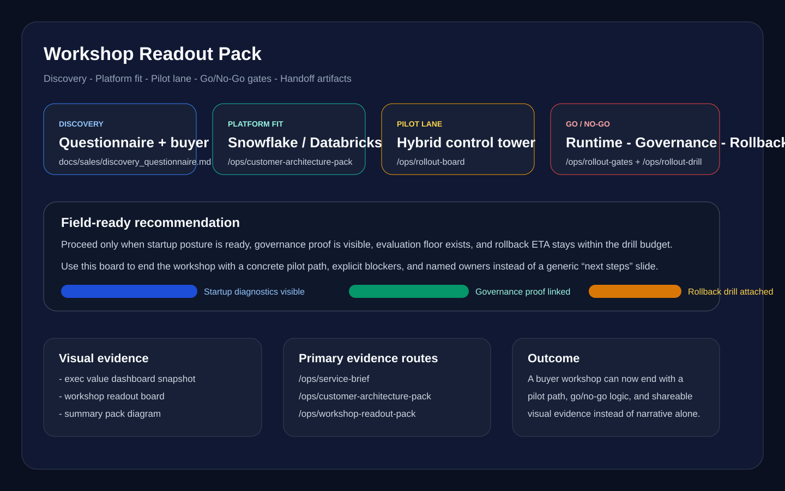

# Enterprise LLM Adoption Kit

[](https://github.com/KIM3310/enterprise-llm-adoption-kit/actions/workflows/ci.yml)
[](https://github.com/KIM3310/enterprise-llm-adoption-kit/actions/workflows/security-scan.yml)
[](https://github.com/KIM3310/enterprise-llm-adoption-kit/actions/workflows/docker-publish.yml)
[](https://www.python.org/downloads/)
[](LICENSE)
[]()

**Discovery -> Secure Architecture -> Evals -> Deployment/LLMOps**

All customers, data, and rollout scenarios in this repo are synthetic. The goal is a reviewable enterprise-style validation kit, not a fictional production claim.

Korean version: `README.ko.md`

---

## Multi-Cloud Architecture

```
                          +---------------------------+
                          |      Ingress (TLS)        |
                          |   nginx / ALB / GCP LB    |
                          +------------+--------------+
                                       |
                          +------------+--------------+
                          |     Kubernetes (HPA)      |
                          |   +-------------------+   |
                          |   | FastAPI Backend    |   |
                          |   | - RBAC / Auth      |   |
                          |   | - RAG (Chroma)     |   |
                          |   | - Safety / Audit   |   |
                          |   | - OpenAPI /docs    |   |
                          |   +--------+----------+   |
                          +------------|----------+---+
                                       |
             +---------------+---------+---------+---------------+
             |               |                   |               |
     +-------+-------+ +----+----+       +-------+-------+ +----+--------+
     |  LLM Provider | | Metrics |       |   Snowflake   | |  Databricks |
     |  OpenAI/Ollama| |Prometheus|       | Eval Results  | |   MLflow    |
     |  stub fallback| | Grafana |       | Audit Logs    | | Delta Tables|
     +---------------+ +---------+       | Query API     | | Experiment  |
                                         +---------------+ |  Tracking   |
             +---------------+---------------+              +-------------+
             |               |               |
     +-------+------+ +-----+------+ +------+------+
     |    AWS       | |    GCP     | |   Docker    |
     |  Terraform   | |  Terraform | | Compose     |
     |  ECS / EKS   | |  GKE / CR  | | Local Dev   |
     +--------------+ +------------+ +-------------+
```

---

## Why this repo matters

A runnable enterprise decision lab:

- discovery artifacts map into system design instead of stopping at strategy slides
- governance, evals, audit, and rollout posture stay visible through working routes
- architecture discussion can be backed by code, metrics, and evidence surfaces

## Repository surfaces
- **Primary runtime:** the runnable product lives under `app/` (backend + frontend demo flow).
- **Supporting evidence:** `docs/`, `evals/`, and `tools/` collect architecture notes, review artifacts, and validation utilities.
- **Generated review bundles:** `dist/application_bundle_*` is generated on demand by `scripts/package_application.sh` and is intentionally not kept as source-of-truth content in the repo.
- **If you're new:** run the app first, then pull in the summary pack and eval artifacts once the runtime story is already clear.

## Demo video
- YouTube: https://youtu.be/yMq03b0js0E

## Snapshot


## Workshop evidence


## Summary Pack At A Glance
- Evaluation API: `GET /ops/service-brief`, `GET /ops/summary-pack`, `GET /ops/summary-pack/schema`
- Workshop closeout surface: `GET /ops/workshop-readout-pack`, `GET /ops/workshop-readout-pack/schema`
- Rollout decision surfaces: `GET /ops/rollout-board`, `GET /ops/rollout-gates`, `GET /ops/rollout-drill`
- Bounded public live lane: `POST /ops/live-workshop-preview`
- Evidence summary: exec dashboard snapshot, security packet, customer journey blueprint, latest eval report
- Platform dialogue: AWS, warehouse, lakehouse, reliable delivery, and MariaDB rollout mapping in one pack

## 2-Minute Proof Path
- `GET /ops/service-brief` -> confirm runtime posture and evidence counts.
- `GET /ops/workshop-readout-pack` -> inspect discovery output, pilot recommendation, visual evidence, and handoff assets.
- `GET /ops/summary-pack` -> inspect buyer promises, rollout tracks, and test assets.
- `GET /ops/rollout-gates` -> inspect go/no-go owners, blockers, rollback posture, and release recommendation.
- `GET /audit/summary` + `GET /metrics` -> show governance and LLMOps signals.
- `docs/architecture/llm_deployment_options.md` + `docs/blueprint/09_customer_journey.md` -> connect evidence to rollout path.

## Quick Start
- `GET /ops/service-brief` -> `POST /auth/login` -> `POST /uc1/architecture` -> `POST /uc2/log-intel`.
- Or: [`docs/architecture/llm_deployment_options.md`](docs/architecture/llm_deployment_options.md) -> `GET /ops/workshop-readout-pack` -> `GET /ops/summary-pack` -> `GET /ops/rollout-gates`.
- Or: `GET /audit/summary` -> `GET /ops/runtime/scorecard` -> `GET /ops/rollout-gates` -> `GET /metrics`.


## Further Reading

- Architecture: [`docs/architecture/llm_deployment_options.md`](docs/architecture/llm_deployment_options.md)
- Blueprint: [`docs/blueprint/`](docs/blueprint/)

## API Documentation (OpenAPI)

Interactive API documentation is available at runtime:

| Surface | URL | Description |
|---|---|---|
| Swagger UI | `/docs` | Interactive API explorer with try-it-out |
| ReDoc | `/redoc` | Clean read-only API reference |
| OpenAPI JSON | `/openapi.json` | Machine-readable spec for codegen |

All endpoints are tagged by domain (`auth`, `uc1`, `uc2`, `ops`, `admin`, `integrations`, `control-tower`, `metrics`, `audit`, `health`) with response models and summaries.

---

## Snowflake Integration

Snowflake integration is **env-var gated** and activates only when `SNOWFLAKE_ACCOUNT` is set. It stores eval results and audit logs in Snowflake tables for historical analysis.

### Setup

```bash
export SNOWFLAKE_ACCOUNT="xy12345.us-east-1"
export SNOWFLAKE_USER="llm_service_account"
export SNOWFLAKE_PASSWORD="..."          # or SNOWFLAKE_PASSWORD_FILE=/run/secrets/sf_pw
export SNOWFLAKE_DATABASE="LLM_OPS"
export SNOWFLAKE_SCHEMA="PUBLIC"         # optional, default PUBLIC
export SNOWFLAKE_WAREHOUSE="COMPUTE_WH"  # optional, default COMPUTE_WH
```

### What it does

- **Eval persistence:** `eval_results` table stores per-sample scores (accuracy, groundedness, helpfulness, safety, latency) with run_id for tracking.
- **Audit persistence:** `audit_logs` table stores hashed audit events with user/role/endpoint metadata.
- **Query interface:** `query_eval_history()` and `query_audit_history()` support filtered lookups by run, user, date range.
- **Aggregate reporting:** `get_eval_summary()` returns avg scores across runs for dashboards.

Tables are auto-created on first connection. Install the connector: `pip install snowflake-connector-python`.

See: [`app/backend/app/snowflake_adapter.py`](app/backend/app/snowflake_adapter.py)

---

## Databricks Integration

Databricks integration is **env-var gated** and activates only when `DATABRICKS_HOST` is set. It provides MLflow experiment tracking and Delta table persistence.

### Setup

```bash
export DATABRICKS_HOST="https://dbc-abc123.cloud.databricks.com"
export DATABRICKS_TOKEN="dapi..."        # or DATABRICKS_TOKEN_FILE=/run/secrets/db_token
export DATABRICKS_SQL_HTTP_PATH="/sql/1.0/warehouses/abc123"  # for Delta tables
export MLFLOW_EXPERIMENT_NAME="enterprise-llm-eval"           # optional
export DATABRICKS_CATALOG="main"                              # optional, Unity Catalog
export DATABRICKS_DELTA_SCHEMA="llm_ops"                      # optional
```

### What it does

- **MLflow experiment tracking:** Each eval run is logged as an MLflow run with parameters (model, temperature, dataset) and metrics (accuracy, safety, latency).
- **Delta audit tables:** `audit_events` and `eval_runs` tables in Unity Catalog for durable, queryable persistence.
- **Query interface:** `query_audit_events()` and `query_eval_runs()` support filtered lookups from Delta tables.

Install dependencies: `pip install mlflow databricks-sql-connector`.

See: [`app/backend/app/databricks_adapter.py`](app/backend/app/databricks_adapter.py)

---

## Kubernetes Deployment

Production-ready Kubernetes manifests are in [`infra/k8s/`](infra/k8s/).

### Manifests

| File | Purpose |
|---|---|
| `deployment.yaml` | 2-replica deployment with rolling updates, health probes, resource limits, security context |
| `service.yaml` | ClusterIP service for internal routing |
| `configmap.yaml` | Non-secret configuration (LLM settings, rate limits, storage options) |
| `secret.yaml` | Secret template for JWT, API keys, Snowflake/Databricks credentials |
| `hpa.yaml` | Horizontal Pod Autoscaler (2-10 replicas, CPU/memory targets) |
| `ingress.yaml` | Nginx ingress with TLS via cert-manager, rate limiting, security headers |

### Deploy

```bash
# Create namespace
kubectl create namespace llm-adoption

# Apply secrets (edit secret.yaml first or use external-secrets-operator)
kubectl apply -f infra/k8s/secret.yaml

# Apply all manifests
kubectl apply -f infra/k8s/

# Verify
kubectl -n llm-adoption get pods,svc,hpa,ingress
```

### Image

The CI pipeline builds and pushes to GHCR on every push to `main`:

```bash
docker pull ghcr.io/OWNER/enterprise-llm-adoption-kit:main
```

---

## Monitoring & Grafana

### Prometheus Metrics

The backend exposes `GET /metrics` with:
- `requests_total` (counter) - by endpoint, use_case, role, status
- `request_latency_seconds` (histogram) - by endpoint, use_case
- `llm_tokens_in_total` / `llm_tokens_out_total` (counters) - by use_case
- `llm_cost_usd_total` (counter) - by use_case
- `llm_failures_total` (counter) - by use_case, provider
- `llm_circuit_events_total` (counter) - by provider, event
- `policy_events_total` (counter) - by event type

### Grafana Dashboard

Import [`infra/monitoring/grafana-dashboard.json`](infra/monitoring/grafana-dashboard.json) into Grafana. Panels include:

- Request rate, error rate, total cost (stat panels)
- Latency P50/P95/P99 (time series)
- Token usage, LLM failures, circuit breaker events
- Policy events by type
- Request breakdown by role and use case (pie charts)

### AlertManager Rules

Load [`infra/monitoring/alertmanager-rules.yaml`](infra/monitoring/alertmanager-rules.yaml) into Prometheus. Alerts:

| Alert | Severity | Condition |
|---|---|---|
| HighErrorRate | critical | >5% error rate for 5m |
| HighLatencyP95 | warning | P95 > 5s for 5m |
| BackendDown | critical | Instance unreachable 2m |
| LLMCircuitBreakerOpen | critical | Circuit breaker tripped |
| LLMHighFailureRate | warning | >0.5 failures/s for 3m |
| LLMCostSpike | warning | Projected >$50/hour for 15m |
| HighInjectionRate | warning | >10% injection rate for 10m |
| HighRefusalRate | warning | >20% refusal rate for 10m |

---

## Monetization and analytics posture

- AdSense and analytics are optional review-surface extras, not part of the core product proof.
- Keep monetization IDs and analytics consent settings environment-specific when moving beyond review/demo deployments.
- For enterprise walkthroughs, prioritize the service brief, summary pack, and audit/metrics routes before any sponsored/community surfaces.

## Project summary (implementation-focused)
- Built an end-to-end adoption kit to show how enterprise LLM discovery turns into a secure, testable, and observable PoC.
- Implemented a working backend + frontend demo so anyone can run it locally and verify behavior.
- Kept the scope realistic: stub LLM adapter, synthetic data, and explicit limitations so the project stays honest.

## My role & scope
- Solo implementation of backend API, frontend UI, eval harness, and pre-sales artifacts.
- Focused on reproducibility: every claim is backed by a doc, a test, or a runnable script.
- Designed with "new hire readiness" in mind: clear separation of concerns, simple setup, and safe defaults.
- Added CI checks via GitHub Actions (backend quality gate, frontend build, eval gate, security scan, Docker publish).

## Core capabilities (what you can see working)
- Role-based access (RBAC) enforced at retrieval time
- Prompt injection detection + safety refusal rules
- PII redaction and audit logging with enterprise-mode hashing
- RAG-style retrieval (Chroma + deterministic hash embeddings)
- Evals with reports + baseline diffs
- LLMOps-ready metrics (latency, tokens, cost, policy events)
- Integration patterns: Slack/Jira-style ingestion endpoints (simulatable from the UI)
- Scenario Runner exports a shareable Markdown report and keeps a local run history (browser localStorage)
- Pre-sales artifacts: discovery wizard, ROI calculator, demo scripts, exec deck
- Snowflake integration for eval/audit persistence (env-var gated)
- Databricks MLflow tracking and Delta table persistence (env-var gated)

## Architecture at a glance (local demo)
- FastAPI backend for UC1/UC2 flows, audit log, metrics, and integrations
- React (Vite) frontend for demo and review workflows
- Chroma for retrieval store (local persistence)
- SQLite for daily cost rollups

## Runtime + artifact map
- Runtime: `app/backend` FastAPI plus the `app/frontend` React/Vite operator UI.
- `docs/` is the editable source for the architecture, sales, and eval collateral referenced by the review APIs.
- `scripts/package_application.sh` assembles timestamped review/export snapshots from `docs/` into `dist/application_bundle_*` when you need a handoff bundle.
- `app/frontend/dist/` is the static publish output for the operator shell, while `dist/scenario_runs/` is generated Scenario Runner output.

## Troubleshooting & verification notes (reproducible checks)
- RBAC leakage risk: access-group filtering enforced in retrieval and re-checked post-query. Verification: `tests/test_rbac.py` and AT-02 in `docs/blueprint/06_acceptance_tests.md`.
- Safety guardrails: refusal rules + prompt injection detection. Verification: `tests/test_safety_guardrails.py` and `tests/test_injection.py`.
- Audit data handling: enterprise mode hashes input/output instead of storing raw text. Verification: `tests/test_data_handling_mode.py`.
- RAG cold-start: index build on startup + normalized dataset generation when missing. Verification: run the demo and confirm citations appear for UC1.
- Python 3.14 compatibility: if `chromadb` import fails (pydantic-v1 issue), the app auto-falls back to a deterministic local retrieval backend so demo flows still run.
- LLM reliability: retry with exponential backoff on provider errors and metrics emitted at `/metrics`.

## What this demonstrates
- Enterprise discovery translated into architecture decisions
- LLM application integration patterns (RBAC, audit logging, redaction, injection defense, tool allowlist)
- Evals harness with regression + baseline diff
- LLMOps readiness (metrics, reliability controls, cost tracking)
- Pre-sales artifacts (demo scripts, objections, MAP, 30/60/90)
- LLM adoption paths (API vs LLM Workspace) and hybrid rollout planning
- Multi-cloud deployment (AWS, GCP, Kubernetes, Docker)
- Data platform integration (Snowflake, Databricks)
- Production observability (Prometheus, Grafana, AlertManager, OpenTelemetry)

## Evidence (what to look at)
- RBAC proof: follow AT-02 in [docs/blueprint/06_acceptance_tests.md](docs/blueprint/06_acceptance_tests.md) (login as Employee vs Admin, run the same UC1 query, compare citations)
- Audit proof: [app/backend/data/sample_audit.json](app/backend/data/sample_audit.json)
- Eval proof: [evals/reports/latest_report.md](evals/reports/latest_report.md)
- Metrics proof: see [docs/blueprint/05_llmops_plan.md](docs/blueprint/05_llmops_plan.md) and `GET /metrics` (counters + latency histogram + policy events)
- Demo scripts: [docs/sales/demo_script_exec.md](docs/sales/demo_script_exec.md), [docs/sales/demo_script_eng.md](docs/sales/demo_script_eng.md)

Quick verify:
```bash
make quality-check
ls app/backend/data/sample_audit.json evals/reports/latest_report.md docs/sales/demo_script_exec.md docs/sales/demo_script_eng.md docs/blueprint/06_acceptance_tests.md
curl -fsS http://localhost:8000/metrics | head -n 20
curl -fsS http://localhost:8000/ops/service-brief | python3 -m json.tool | head -n 60
curl -fsS http://localhost:8000/ops/summary-pack | python3 -m json.tool | head -n 60
curl -fsS http://localhost:8000/ops/rollout-gates | python3 -m json.tool | head -n 60
curl -fsS http://localhost:8000/ops/summary-pack/schema | python3 -m json.tool | head -n 40
curl -fsS http://localhost:8000/ops/service-brief/schema | python3 -m json.tool | head -n 40
```

## Runtime Surfaces
- `GET /ops/service-brief`: concise runtime + evidence + rollout stage contract for buyers, operators, and operators
- `GET /ops/workshop-readout-pack`: field-ready workshop closeout pack tying discovery, pilot lane, rollout gates, and visual evidence together
- `GET /ops/summary-pack`: executive-facing review surface with rollout tracks, platform dialogue, and review sequence
- `GET /ops/rollout-board`: compact rollout decision board for matching buyer fit, runtime posture, and delivery lane
- `GET /ops/rollout-gates`: go/no-go gate surface for runtime, governance, eval, and rollback decisions
- `GET /ops/rollout-drill`: rollback drill surface for guardrail trip points, kill-switch posture, and rollout recovery
- `GET /ops/summary-pack/schema`: explicit contract surface for review actions, test assets, and runtime surfaces
- `GET /ops/service-brief/schema`: explicit contract surface for the service brief payload
- Home/Readiness UI now renders an `Executive Readiness Board` plus `Executive Summary Pack`, including review actions, test assets, and runtime surfaces, even in static mode

## Customer journey (Discovery -> Production)
- Blueprint: `docs/blueprint/09_customer_journey.md`
- Deployment options (API vs Workspace): `docs/architecture/llm_deployment_options.md`
- Eval framework template: `docs/evals/eval_framework_template.md`
- Eval report template: `docs/evals/customer_eval_report_template.md`
- Executive summary template: `docs/sales/executive_summary_template.md`
- Technical deep dive outline: `docs/sales/technical_deep_dive_outline.md`
- Role alignment: `docs/application/role_alignment.md`
- Security & compliance packet: `docs/sales/security_compliance_packet.md`
- LLM Workspace checklist: `docs/sales/llm_workspace_checklist.md`
- RFP requirements matrix: `docs/application/rfp_requirements_matrix.md`
- QBR template: `docs/sales/qbr_template.md`
- Sample scenario (one-pager): `docs/sales/sample_scenario_onepager.md`

## How to run (local)
1) Backend
```
cd app/backend
python3 -m venv .venv
source .venv/bin/activate
python -m pip install -U pip
python -m pip install -e ".[dev]"
python3 -m app
```
Optional local Ollama runtime:
```bash
# terminal A
ollama serve

# terminal B (before backend start)
export LLM_PROVIDER=ollama
export LLM_MODEL=llama3.1:8b
export LLM_OLLAMA_BASE_URL=http://127.0.0.1:11434
python3 -m app
```
2) Frontend
```
cd app/frontend
npm install
npm run dev
```
3) Visit `http://localhost:5173`

## How to run (docker)
```
cd infra
docker-compose up --build
```

## One-command demo (no docker)
If you don't have Docker installed, use the local runner script:
```bash
# auto mode: tries Ollama first, then falls back to stub
make demo-local
```

## Ollama quick start (recommended)
Run a local model and experience the full flow without paid API keys.

```bash
# install Ollama first: https://ollama.com/download
ollama pull llama3.2:latest
make demo-ollama-local
```

The script starts backend + frontend and opens a ready local flow on `http://localhost:5173`.

## Value tour (5 minutes)
Use this sequence to feel the service utility, not just feature checkboxes:

1. In Access Control, issue an `Ops` token.
2. Run UC1 with a handover query (for example: "Summarize payment-prod handover risks and next actions").
3. Run UC2 with timeout/error logs and compare generated root causes + runbook steps.
4. Open Scenario Runner and export the report + evidence pack (zip + SHA-256 manifest).
5. Review `/audit/summary` and `/metrics` to verify governance and LLMOps signals.

## Scenario Runner (CLI)
Generate a shareable validation report (Markdown) + evidence pack (zip).

Against an already-running backend:
```bash
make scenario-run
```

One command (auto: Ollama if available, otherwise stub):
```bash
make scenario-demo-local
```

Force Ollama mode:
```bash
make scenario-demo-ollama-local
```

Output is written under `dist/scenario_runs/` (gitignored).

## One-command demo (docker)
```
make demo
```

## Evaluation
- Datasets: `evals/datasets/initial_20.jsonl`, `evals/datasets/starter_50.jsonl`
- Runner: `python3 evals/runner/run_eval.py --dataset evals/datasets/initial_20.jsonl`
- Reports: `evals/reports/latest_report.json`, `evals/reports/latest_report.md`, baseline diff

## Tests
```bash
python -m pytest -q tests app/backend/tests
```

## Backend quality gate
```bash
make quality-backend
```

## Metrics
- Prometheus endpoint: `GET /metrics`
- Request counters, latency histogram, token usage, cost estimates, policy events

## Production Runtime Options (implemented)
- Auth mode:
  - `AUTH_MODE=local_jwt` (default) or `AUTH_MODE=oidc`
  - OIDC verify: `OIDC_ISSUER`, optional `OIDC_AUDIENCE`, optional `OIDC_JWKS_URL`
  - optional login hardening: `DEMO_LOGIN_CODE=<shared-code>` (requires code in `POST /auth/login`)
  - login abuse guard (when login code is enabled): `LOGIN_ATTEMPT_CAPACITY=10`, `LOGIN_ATTEMPT_REFILL_PER_SEC=0.1`
- JWT key rotation:
  - `JWT_ACTIVE_KID=v2`
  - `JWT_SECRETS="v1:old-secret,v2:new-secret"` (or `JWT_SECRETS_FILE` JSON map)
- OIDC token exchange:
  - `POST /auth/oidc/exchange` with `{ "id_token": "..." }`
- LLM provider:
  - `LLM_PROVIDER=stub` (default, offline), `LLM_PROVIDER=ollama`, or `LLM_PROVIDER=openai` / `LLM_PROVIDER=openai_compatible`
  - `LLM_OLLAMA_BASE_URL` (default `http://127.0.0.1:11434`)
  - Ollama local mode (no API key required): `LLM_PROVIDER=ollama`, optional `LLM_MODEL=llama3.2:latest`, optional `LLM_OLLAMA_BASE_URL=http://127.0.0.1:11434`
  - `LLM_OPENAI_API_KEY` (or `LLM_OPENAI_API_KEY_FILE`)
  - optional `LLM_OPENAI_BASE_URL`, `LLM_OPENAI_ORG`
  - reliability fallback: `LLM_FALLBACK_TO_STUB_ON_ERROR=true` (default)
  - circuit breaker: `LLM_CIRCUIT_BREAKER_THRESHOLD=3`, `LLM_CIRCUIT_BREAKER_COOLDOWN_SEC=30`
- Integration auth:
  - `INTEGRATIONS_REQUIRE_AUTH=true` (default)
  - when enabled, `POST /integrations/slack/events` and `POST /integrations/jira/ticket` require `Authorization: Bearer <JWT>`
  - if bearer includes multiple roles, integrations run with highest privilege role (`Admin > Ops > Employee`)
- Request guardrails:
  - `REQUEST_MAX_BODY_BYTES=262144` (default)
  - payloads larger than this return `413 Request body too large`
  - validation failures return a standard `422` envelope with `request_id` and normalized error list
- Ops policy and alerts:
  - `GET /ops/policy`
  - `GET /ops/alerts` and `GET /ops/alerts?deliver=true`
  - optional webhook: `OPS_ALERT_WEBHOOK_URL`
- Event logging hygiene:
  - service event/control-tower contexts are sanitized before persistence (token/secret/password fields are redacted)
- Storage backend:
  - `EVENT_STORAGE_BACKEND=sqlite` (default) or `EVENT_STORAGE_BACKEND=jsonl`
  - JSONL paths: `SERVICE_EVENTS_JSONL_PATH`, `CONTROL_TOWER_DECISIONS_JSONL_PATH`, `DAILY_COST_JSON_PATH`

## Environment Variables

All environment variables are documented in [`.env.example`](.env.example). Copy it to `.env` and fill in values for your deployment.

## Role alignment
- Employee: limited docs
- Ops: ops docs
- Admin: all docs

## Swap-in guidance
- **OIDC/SAML**: replace `/auth/login` with external IdP; validate JWT with IdP public keys
- **LLM API**: implement `LLMAdapter` with provider SDK, map token usage + cost
- **LLM Workspace**: align SSO/SAML and admin policy requirements with enterprise governance
- **Cloud storage**: replace local SQLite and file paths with managed DB/object store
- **Snowflake**: set `SNOWFLAKE_ACCOUNT` env var to activate eval/audit persistence
- **Databricks**: set `DATABRICKS_HOST` env var to activate MLflow tracking and Delta tables

## CI/CD Pipeline

| Workflow | Trigger | What it does |
|---|---|---|
| `ci.yml` | Push/PR to main | Backend tests (80%+ coverage), frontend build, eval gate, review gate |
| `backend-quality-gate.yml` | Backend changes | Linting and quality checks |
| `docker-publish.yml` | Push to main / tags | Build and push Docker image to GHCR |
| `security-scan.yml` | Push/PR + weekly cron | pip-audit, bandit SAST, Trivy filesystem scan |
| `pages-auto-deploy.yml` | Push to main | Frontend deployment |
| `production-smoke.yml` | Push to main | Production smoke tests |

## Pre-Sales Kit Extras
- Discovery Wizard: `python3 app/backend/scripts/discovery_wizard.py`
- ROI Calculator: `python3 app/backend/scripts/roi_calculator.py --handle-time-min 12 --tickets-per-week 800 --hourly-cost 35 --deflection-rate 0.25 --adoption-rate 0.6`
- PoC Success Generator: `python3 app/backend/scripts/poc_success_generator.py`
- BYO Dataset Ingest: `python3 evals/runner/dataset_ingest.py --input evals/datasets/sample_dataset.csv`
- Eval Gate: `make eval-gate`
- Audit Viewer: `python3 app/backend/scripts/audit_viewer.py --log app/backend/data/audit.log` (generated at runtime)
- Exec Deck: `python3 app/backend/scripts/generate_exec_deck.py`
- Modules index: `docs/modules/README.md`
- Integration demo checklist: `docs/sales/integration_demo_checklist.md`
- Red-team summary: `docs/evals/redteam_summary.md`
- Exec dashboard snapshot: `docs/sales/exec_value_dashboard/snapshot.svg`
These test artifacts and demo scripts are designed to support discovery and PoC alignment in pre-sales conversations.

## UI walkthrough (local)
- Tabs: Overview / Capabilities / Readiness / Scenario Runner / Console
- Scenario Runner: runs JWT -> UC1 -> UC2 -> governance/ops checks and exports a Markdown report
- Console: lets operators call UC1/UC2 and load `/audit/summary` and `/ops/runtime` (role-gated)

## Publishing safety (before you push)
This repo is safe to publish: runtime data (SQLite DB, audit log, Chroma persistence) is generated locally and ignored by git.

```bash
make sanitize
```

## KR evals
- KR dataset: `evals/datasets/kr_enterprise_30.jsonl`
- KR eval run: `python3 evals/runner/run_eval.py --dataset evals/datasets/kr_enterprise_30.jsonl`

## Glossary (first-time readers)
- PoC: Proof of Concept
- RBAC: Role-Based Access Control
- PII: Personally Identifiable Information
- RAG: Retrieval-Augmented Generation
- OIDC: OpenID Connect
- IaC: Infrastructure as Code (e.g., Terraform)
- HPA: Horizontal Pod Autoscaler
- GHCR: GitHub Container Registry

## Local Verification
```bash
/Library/Developer/CommandLineTools/usr/bin/python3 -m venv app/backend/.venv
source app/backend/.venv/bin/activate
python -m pip install -U pip
python -m pip install -e "./app/backend[dev]"
python -m pytest -q tests app/backend/tests
(cd app/frontend && npm run build)
```

## OpenTelemetry (opt-in)

Telemetry is **opt-in** and only activates when the `OTEL_EXPORTER_OTLP_ENDPOINT` environment variable is set.

```bash
# Point at any OTLP-compatible collector (e.g. Jaeger, Grafana Tempo, Datadog)
export OTEL_EXPORTER_OTLP_ENDPOINT="http://localhost:4317"
python3 -m app
```

When enabled the runtime will:
- Initialize an OTLP trace exporter with service name `enterprise-llm-adoption-kit`.
- Auto-instrument FastAPI routes via `opentelemetry-instrumentation-fastapi`.
- Provide context-manager span helpers for LLM calls, safety checks, RBAC evaluation, and RAG retrieval.
- Record OpenTelemetry metrics: `llm_requests_total` (counter), `llm_request_duration_seconds` (histogram), `safety_blocks_total` (counter), `rbac_denials_total` (counter), and `rag_retrieval_duration_seconds` (histogram).

| Variable | Purpose | Default |
|---|---|---|
| `OTEL_EXPORTER_OTLP_ENDPOINT` | OTLP collector URL (gRPC) | _(unset = telemetry off)_ |

The existing Prometheus metrics at `GET /metrics` remain unchanged.

## Repository Hygiene
- Keep runtime artifacts out of commits (`.codex_runs/`, cache folders, temporary venvs).
- Prefer running verification commands above before opening a PR.
