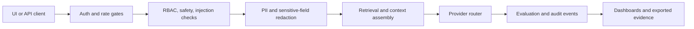

# Technical Review Pack

## System Boundary

This repository models an LLM governance surface that can be run with synthetic data and a stub provider. Optional live providers are treated as integrations, not as requirements for understanding or verifying the core behavior.

Primary boundary:

- authenticate requests and preserve role-aware behavior
- detect prompt-injection and unsafe content patterns before generation
- redact sensitive fields before they enter downstream prompts
- route requests through a deterministic provider when live credentials are absent
- write audit and evaluation evidence that can be replayed

## Architecture Notes



The important design choice is that the governance path remains observable even when the model path is stubbed. That keeps tests stable and makes policy behavior inspectable without external services.

## Demo Path

```bash
make install
make test
python scripts/run_scenario_local.sh
```

For a quick code read, inspect:

- `app/backend/app/main.py`
- `app/backend/app/llm_adapter.py`
- `tests/test_injection.py`
- `tests/test_redaction.py`
- `tests/test_eval_runner.py`

## Validation Evidence

- Unit and integration tests cover auth, redaction, injection checks, eval execution, data handling mode, and UI metadata.
- CI runs on every main update.
- Secret scanning and dependency architecture are configured in `.github/workflows/`.
- The app includes synthetic fixtures so the governance path can be exercised without private data.

## Threat Model

| Risk | Control |
|---|---|
| Prompt-injection attempt | pre-generation heuristic checks and refusal path |
| Sensitive input leakage | redaction layer and audit-safe output shape |
| Live provider dependency | stub mode and deterministic tests |
| Unapproved tool execution | allowlisted tool executor |
| Audit drift | schema tests and replayable evaluation fixtures |

## Maintenance Notes

- Keep live-provider code optional.
- Add regression tests before changing refusal, redaction, or routing behavior.
- Treat any new fixture as public data.
- Prefer deterministic test fixtures over network-dependent examples.
